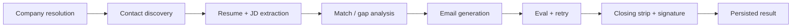

# Inroad


Targeted Outreach Platform

Discover a plausible hiring contact for a company, then draft a resume↔JD–grounded cold email with an automated quality check — copy-paste only; the app never sends mail.

## What problem this solves

New-grad job seekers trying to bypass the ATS via direct outreach hit three compounding frictions: they often don't know who to email, contact data from any single source is unreliable, and genuine personalization doesn't scale across many applications. The result is too few high-quality emails, or too many generic ones, with no reliable feedback loop.

Inroad takes a company and a role, discovers a contact with a transparent confidence signal, drafts outreach grounded in a structured resume↔JD comparison (not a generic prompt), and judges that draft against a rubric before the user ever sees it. Sending stays in the user's own mail client — a structural guarantee, not a policy promise.

## Demo


No public live demo is linked here — deployment is deliberately deferred (see [Current status](#current-status--roadmap)).

## Why this isn't just a CRUD-plus-AI wrapper

Contact-finder-plus-AI-email tools are common. The substance here is in the engineering underneath:

- **Resilience engineering** — multi-vendor contact discovery behind a `ContactProvider` interface, with status-result graceful degradation (rate limits / errors / empty tiers) and Postgres-backed cost-aware caching so failed or empty providers don't take down the pipeline.
- **Data reconciliation & confidence modeling** — normalize conflicting provider schemas, handle name collisions, and expose an explainable confidence breakdown (verification tier, corroboration, employment-currency, domain check) rather than a hand-waved single score.
- **Applied LLM evaluation, not just LLM calling** — structured resume/JD extraction, match/gap analysis that grounds generation, and a rubric-based judge with hard gates plus a silent single retry before anything is shown to the user.
- **Product & security judgment** — several explicit "why I didn't build X" calls (Gmail OAuth trust tradeoff, Redis rejection, login rate-limiting before public deploy). The reasoning lives in [`docs/ARCHITECTURE.md`](docs/ARCHITECTURE.md) and [`docs/OPEN_QUESTIONS.md`](docs/OPEN_QUESTIONS.md).

## Tech stack

- **Backend:** Python, FastAPI `0.141`, SQLAlchemy `2.0`, Alembic `1.18`, Pydantic `2.13`, PyJWT, bcrypt, uvicorn
- **Database:** PostgreSQL (`psycopg2`, JSONB columns)
- **LLM:** Anthropic API (`anthropic` SDK; default model `claude-haiku-4-5`)
- **Contact providers:** Hunter.io (live) + scripted `MockProvider` for local/dev; Apollo / Anymail deferred
- **Frontend:** React `19`, TypeScript, Vite `8`, React Router `7`, TanStack Query `5`

Exact pins: [`backend/requirements.txt`](backend/requirements.txt), [`frontend/package.json`](frontend/package.json).

## Pipeline



## Running it locally

You need PostgreSQL running locally, a Python 3 venv for the backend, and Node for the frontend. Contact discovery can run entirely on the mock provider (no paid API keys); resume/JD extract and email generation need an Anthropic API key.

### Backend

```bash
cd backend
python -m venv .venv
source .venv/bin/activate   # Windows: .venv\Scripts\activate
pip install -r requirements.txt
cp .env.example .env        # then edit values
```

Create a Postgres database that matches `DATABASE_URL` (the example uses a DB named `outreach`), then:

```bash
# from backend/, with venv active and .env loaded
alembic upgrade head
uvicorn app.main:app --reload
```

API defaults to `http://localhost:8000`. Key env vars (see [`backend/.env.example`](backend/.env.example)):

| Variable | Notes |
|---|---|
| `DATABASE_URL` | SQLAlchemy URL, e.g. `postgresql+psycopg2://…/outreach` |
| `JWT_SECRET_KEY` | Long random string |
| `ANTHROPIC_API_KEY` | Required for extract / match / generate / eval |
| `CONTACT_PROVIDER` | `mock` (default) or `hunter` |
| `HUNTER_API_KEY` | Only when `CONTACT_PROVIDER=hunter` |

**Mock-first contact discovery:** leave `CONTACT_PROVIDER=mock`. The router wires scripted fixtures (`acme.com`, `globex.com`, `empty.co`) so you can exercise tiering, fallback reasons, and the not-found path without spending Hunter credits — see [`docs/ARCHITECTURE.md`](docs/ARCHITECTURE.md) §4.5. Clearbit company autocomplete is keyless.

### Frontend

[`frontend/README.md`](frontend/README.md) is the stock Vite template (ESLint / React Compiler notes). Project-specific setup:

```bash
cd frontend
cp .env.example .env        # VITE_API_BASE_URL=http://localhost:8000
npm install
npm run dev
```

App defaults to `http://localhost:5173` (CORS allowlist matches that origin by default).

## Current status / roadmap

**Built and demoable end-to-end through the frontend:** auth (JWT access + DB-backed refresh), company name resolution, contact discovery (Hunter + mock fixtures), resume upload + JD paste with structured extraction, match/gap analysis, grounded email generation, rubric eval with silent retry, deterministic closing strip + signature append, and a six-frame SPA flow on `/`.

**Deliberate next steps (not missed gaps):**

- Outcome logging + personal analytics (Phase 4 — meant to ship alongside real use)
- Additional contact providers (Apollo, Anymail — explicitly deferred)
- Public / live deployment (deferred until login rate-limiting and related abuse/cost controls land — see [`docs/OPEN_QUESTIONS.md`](docs/OPEN_QUESTIONS.md))

Stretch after that: iterative refine UI, refresh-token rotation / cookie transport, and only revisit Gmail OAuth if the trust-model concern is resolved. Full scope and rationale: [`docs/product_discovery_summary.md`](docs/product_discovery_summary.md). Living implementation snapshot: [`docs/PROGRESS.md`](docs/PROGRESS.md).

## Engineering docs

For the reasoning behind specific decisions (not just what shipped):

| Doc | What it covers |
|---|---|
| [`docs/ARCHITECTURE.md`](docs/ARCHITECTURE.md) | Backend/frontend structure, provider interface, Postgres-as-cache (and why not Redis), LLM client, company resolution, SPA flow |
| [`docs/DATA_MODEL.md`](docs/DATA_MODEL.md) | Pydantic schemas per entity, JSONB / enum / migration conventions |
| [`docs/OPEN_QUESTIONS.md`](docs/OPEN_QUESTIONS.md) | Explicit deferrals with revisit triggers, plus resolved design debates |
| [`docs/product_discovery_summary.md`](docs/product_discovery_summary.md) | Product scope, MVP vs deferred features, eval rubric, phased roadmap |
| [`docs/PROGRESS.md`](docs/PROGRESS.md) | Session-overwritten verified implementation snapshot (what's real vs not started) |
